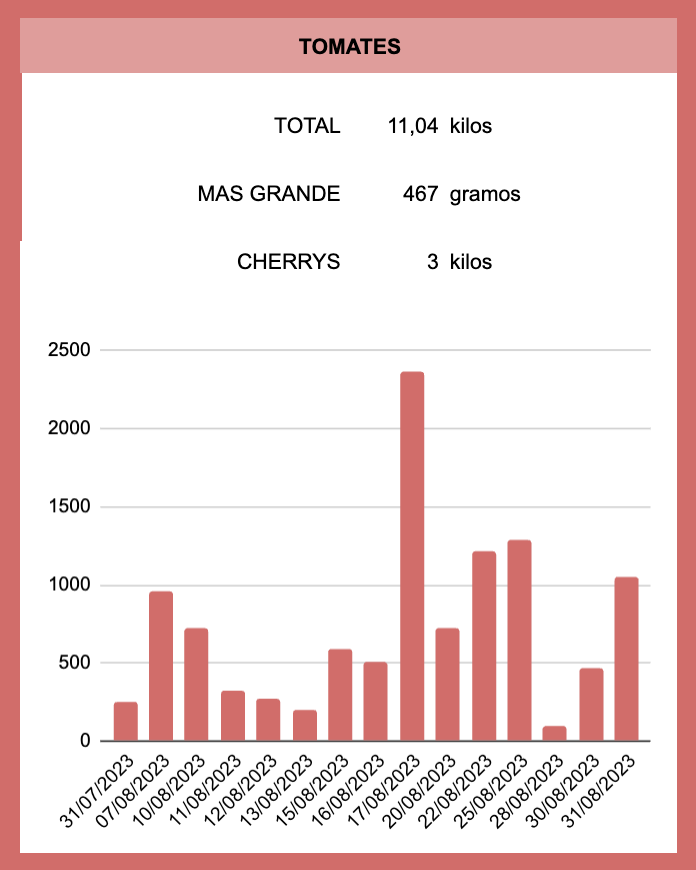

# Tomato Project
### Tomato harvesting at home during 2023 Summer.

After many years planting seeds, protecting the seedlings and harvesting amazing tomatoes, this year I convinced my family to gather also data, weighting every tomato and collecting interesting information to see how productive was our 10 m2 garden. So far in August we harvested 11 kilos of tomatoes, I will update the following chart on a monthly basis till the Winter comes.

https://pablo-ferro.github.io/TomatoProject/
